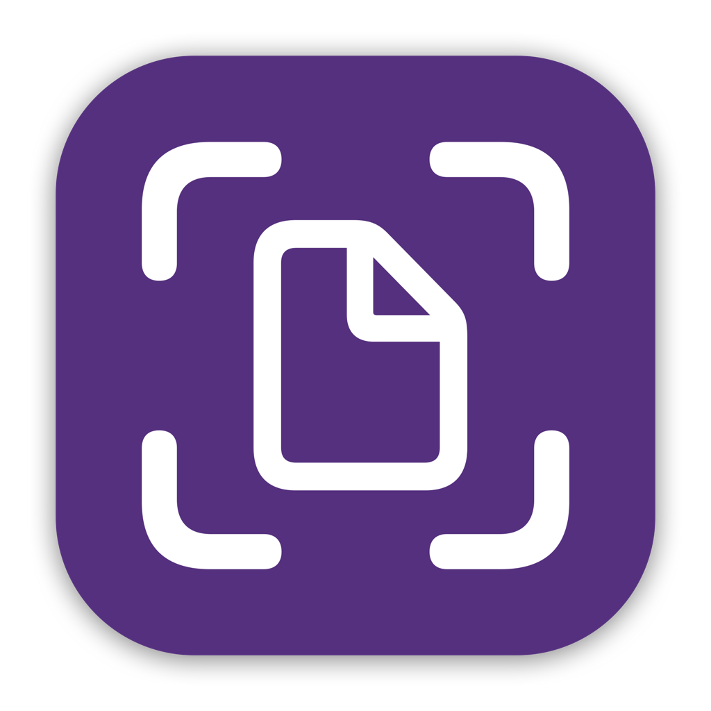

<h1 align="center">
    
    <br />
    <b>DocMatic - Document Scanner</b>
</h1>

<div align="center">
    <a href="https://developer.apple.com">
        
    </a>
    <a href="https://buymeacoffee.com/paulrodenjr">
        
    </a>
    <a href="https://github.com/RodenPaul86/DocMatic/blob/main/LICENSE">
        
    </a>
</div>

<br />

<p align="center">
    <a href="#download">Download</a>
    •
    <a href="#features">Motivation</a>
    •    
    <a href="#features">Features</a>
    •    
    <a href="#requirements">Requirements</a>
    •    
    <a href="#screenshots">Screenshots</a>
    •
    <a href="#support">Dependencies</a>
    •
    <a href="#support">Support</a>
    •    
    <a href="#license">License</a>
</p>

## Download

<div align="center">
    <h4><b>You can get DocMatic from one of the links below! 👇</b></h4>
    <a href="https://apps.apple.com/us/app/prolight/id1173567157">
        
    </a>
    <a href="https://github.com/RodenPaul86/ProLight/releases/tag/3.3.6">
        
</div>

## Motivation

<p>
There are many document-scanning apps available, but only a few that truly get it right—DocMatic is one of them.

DocMatic is designed to be a fast, intuitive, and privacy-focused document scanner that meets users’ expectations without unnecessary complexity.

As part of my [portfolio](https://paulrodenjr.org) projects. DocMatic showcases my expertise in iOS development, combining powerful features with a seamless user experience.
</p>

## Features

### General

* Ad-free.
* Document Scanning.
* Save & Share.
* Biometric Lock.
* Local Storage.
* Apple’s Files App Integration.

### Settings

* Changing the appearance.
* Alternate app icons.
  
## Requirements

- Xcode 16.2
- iOS 18+

## Screenshots

<div align="left">
    <h3><b>iOS:</b></h3>
    <div align="left">
    
    </a>
    <br/>
        
## Dependencies

```swift
dependencies: [
    .package(url: "https://github.com/RevenueCat/purchases-ios.git", from: "5.15.1")
]
```

## Support

As an independent iOS developer, I’ve built several apps over the years, but DocMatic is my latest and most exciting project. Bringing it to life has been an incredible journey, and I’m eager to see it grow.

I’m dedicated to continuously enhancing DocMatic with new features, improvements, and bug fixes. Your support means the world to me—it helps ensure that DocMatic keeps evolving and getting better. Thank you for being part of this journey!

<br />

<div align="center">
    <a href="https://buymeacoffee.com/paulrodenjr">
        
    </a>
</div>

<br />

Thank you!

## License
DocMatic is written in (Swift) and is distributed under the terms of the [Apache License](https://github.com/RodenPaul86/DocMatic/blob/main/LICENSE) Version 2.0).

